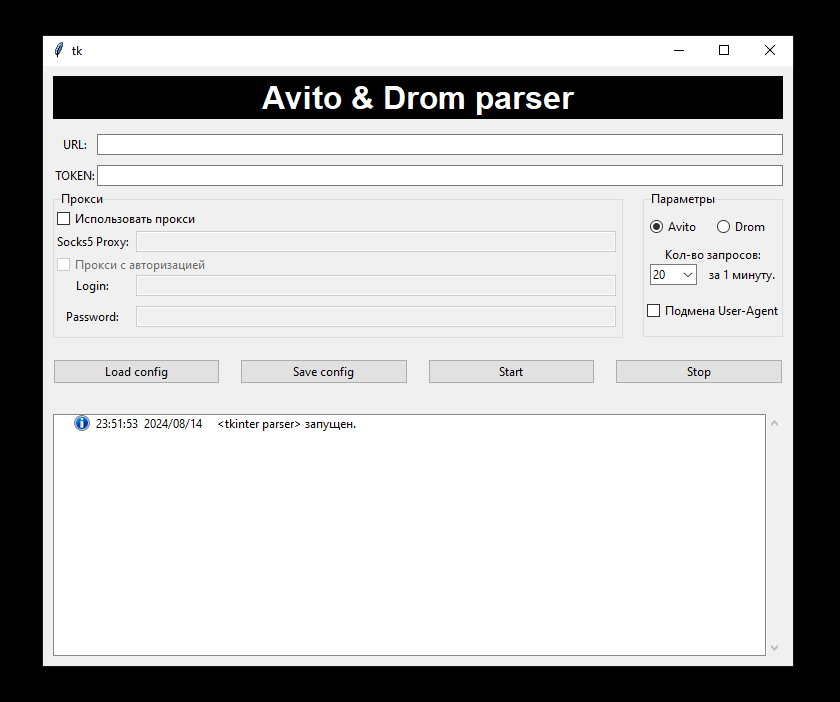

# Parser avito, drom (tkinter, selenium, bs4, telebot)

Мой старый заказной проект (2021-2022)

#### Описание:
Парсер ищет новые объявления по определённому URL адресу и скидывает в чат c помощью telegram-бота .

#### Основа:
* графическая оболочка > Tkinter
* парсинг > BeautifulSoup4 + lxml
* сбор данных с сайта > Selenium
* telegram-бот > pyTelegramBotAPI
* многопоточнось

#### Функции:
* парсинг Avito
* парсинг Drom
* подмена user-agent
* применение proxy
* логирование
* рандомизация интервалов между запросами
* сохранение текущей конфигурации в файл
* загрузка конфигурации из файла

## Установка и запуск

клонируем
```
git clone https://github.com/sita8281/parser_avito_drom.git
```

устанавливаем окружение
```
cd parser_avito_drom
python -m venv venv
```

активируем окружение (Linux)
```
cd venv/bin
source activate
```

активируем окружение (Windows)
```
cd venv/scripts
activate.bat
```

установка пакетов
```
pip install -r requirements.txt
```

запуск
```
python start.py
```

## Demo




